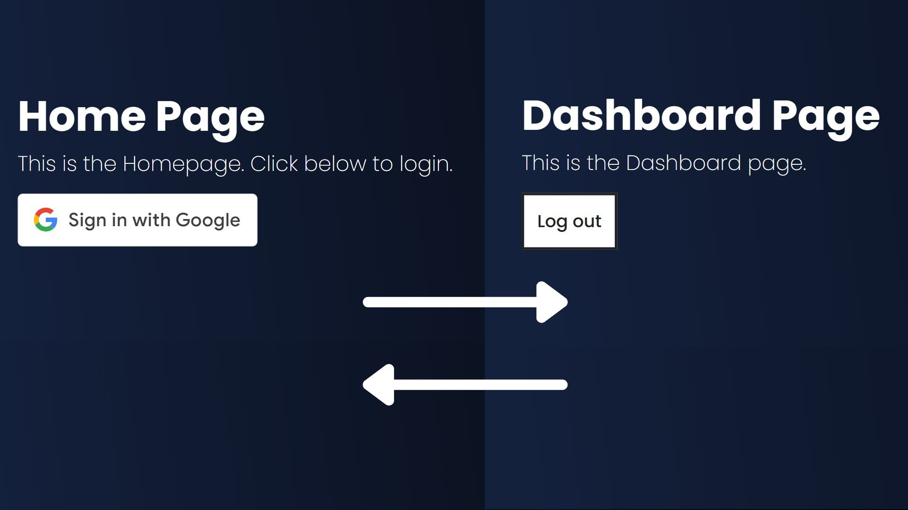

# Google OAuth Integration with React

## Features

- ✅ Secure Google authentication using OAuth 2.0  
- 🔄 Automatic user redirection after login  
- 🔍 JWT token decoding for user information  
- 🧹 Session redirection on logout  
- 📱  Responsive UI components  

## Frontend Implementation

The application provides a seamless Google login experience with React, using modern authentication flows.

### Key Technologies

- ⚛️ React  
- 🛣️ React Router  
- 🔑 React OAuth2 | Google 
- 🔓 jwt-decode  
- 🎨 HTML/CSS  

### Components

#### **Home Page** - (Landing page with Google login functionality)
- 🔄 Auto-select for returning users  
- ✅ Success and error handling  
- 🔍 JWT credential decoding  
- ➡️ Automatic redirection to dashboard  

#### **Dashboard**  - (Authenticated user area)  
- 🚪 Google logout functionality  
- 🧹 Session cleanup  
- ↩️ Post-logout redirection  

### **Security Notes**
- 🔒 Uses Google's official OAuth flow
- 🚫 No sensitive data stored in plain text

### **Future Enhancements**
- 💾 Client-side token storage (localStorage)
- 🧹 Proper session cleanup on logout
- 🛡️ Add auth context/provider
- 🚧 Implement protected routes
- 🔐 Add server-side session validation
- 🔌 Support multiple auth providers

## Contributing

Contributions are currently closed at this moment!